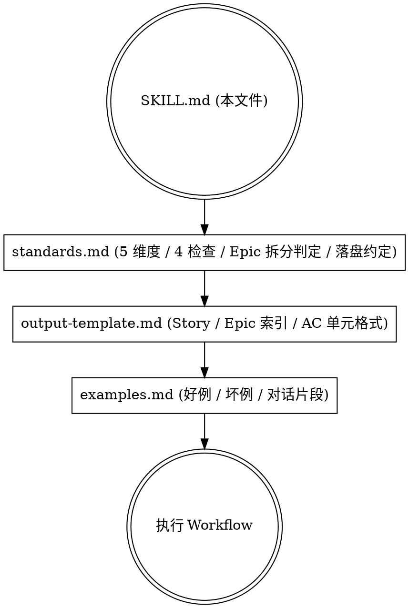
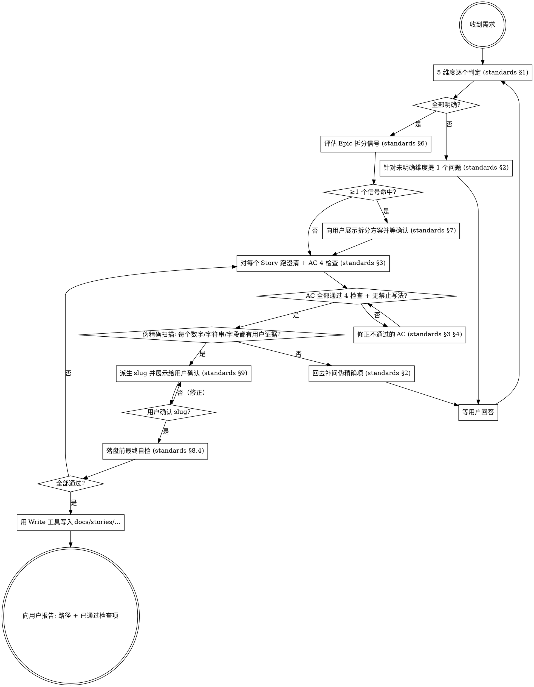

# story-ac-author

## Overview

把自然语言需求转换为可评审、可交付、可独立验证的敏捷 User Story 与 Acceptance Criteria，并写入 `docs/stories/` 文件。

**核心原则**：

1. **5 个澄清维度全部"明确"之前不得生成 Story。** 用户不愿回答 ≠ 维度已明确。
2. **每条 AC 落盘前必须通过 4 项硬性检查。** 写不出具体值就说明 Story 没拆细，回去拆。
3. **任务要求生成文档时必须写入文件。** 不得只在对话里贴 Markdown。
4. **Epic 拆分信号命中后必须先与用户确认拆分方案，不得自行合并或自行拆分。**

## Iron Law

```
违反字面规则 = 违反精神。
"用户让我快点 / 用户说不要问 / 业内常识可以补" 都不是跳过澄清的理由。
跳过澄清 → 删掉草稿，回去走第 1 步。
```

## When to Use

- 用户给出含糊、单句、口头需求："我想做一个 X 功能"
- 用户给出多角色/多流程的复合需求（命中 Epic 拆分信号）
- 用户给出"看似清楚"的需求，但缺少边界/异常/范围声明
- 用户给出明确想跳过澄清的压力："别问了/挺清楚的/快点出"
- 任务要求把需求落地为 `docs/stories/` 下的可评审文档

## When NOT to Use

- 已有完整需求文档，仅需要复制/重排版（不需要澄清）
- 项目内部技术任务、不面向最终用户/角色（Story 模型不适用）
- 仅是 bug 修复或重构（不需要 As-a-I-want-So-that 框架）

## Read Order（首次激活时按顺序读）



文件职责：

- `SKILL.md`（本文件）：硬约束、执行顺序、合理化对照表、红旗清单。
- `standards.md`：5 维度判定标准、按需提问流程、AC 4 检查、禁止写法、Epic 拆分判定信号、文件落盘约定、slug 规则。
- `output-template.md`：Story / Epic README / AC 单元的 Markdown 骨架与强制字段。
- `examples.md`：好例（单 Story、Epic 拆分）、坏例（违规 AC）、对话片段。

## Workflow（必做顺序）



## 硬约束（HARD CONSTRAINTS）

凡涉及"是否能开始/继续/落盘"的判断，以下约束**全部**生效，任何一条违反 = 推倒重来。

### H1. 澄清阶段

- **不得**在用户给出模糊需求时直接进入 Story 撰写。
- **不得**在同一条消息里问多个澄清问题。一次只问一个。
- **不得**用"业内默认值 / 行业惯例"代替"已明确"。未提及 ≠ 无要求。
- **不得**因为用户说"别问了 / 挺清楚的 / 快点"就跳过未明确维度。可以缩短问题，但不得跳过。
- **必须**在每个判为"明确"的维度记录用户原文证据，写入最终文档的"澄清记录"表。

### H2. Epic 拆分阶段

- **必须**在 5 维度澄清完成后评估 standards §6 的 5 个信号。
- 信号 ≥ 1 命中时**必须**先与用户展示拆分方案并等确认，不得直接拆分，也不得直接合并。
- 用户坚持"一个 Story 搞定"但信号命中时，**不得**为了顺从而合并；继续展示拆分理由直到达成一致或用户明确撤回需求。

### H3. AC 撰写阶段

- 每条 AC 写完后立刻跑 standards §3 的 4 项检查（输入具体 / 期望可观察 / 边界明确 / 可独立验证）。
- 命中 standards §4 任一禁止词的 AC，不得保留，必须修正。
- AC 中**不得**出现"或 X 或 Y"这类二选一未定的写法。要么定一个，要么拆成两条 AC（成功路径 + 异常路径）。
- AC 中**不得**出现伪精确——下列内容只要不是用户/产品/架构师确认过的值，就视为伪精确，必须回去补问：
  - **业务数字**：金额、数量、阈值、字符长度、字符集
  - **SLA / 性能数字**：`P95 ≤ Xms`、接口超时、并发数、请求频率
  - **HTTP / 接口契约**：状态码、error code 字符串（如 `OTP_INVALID`）、response body 字段名（如 `remainingAttempts`）
  - **实现细节字符串**：Redis key schema（如 `otp:register:*`）、DB 列名、表名、状态机枚举值、消息模板 ID
  - **UI 文案**：toast 文字、按钮文字、错误提示原文
- 占位 fixture 值（如 `alice@example.com`、`123456`）允许由 skill 直接使用，但必须遵循用户已确认的格式约束（如"6 位数字验证码"已确认）。占位值不属于伪精确。
- 区分判据：**"用户/PM/架构师能反对的内容" → 必须有用户确认依据；"测试 fixture 占位值" → skill 可自定**。

### H4. 落盘阶段

- **必须**用 Write 工具实际写入 `docs/stories/...`，不得仅在对话里贴 Markdown。
- 落盘前**必须**先派生 slug 并向用户展示，等用户确认（按 standards §9）。slug 派生过程对用户透明；用户未确认的 slug 不得落盘。
- 落盘前**必须**对每条 AC 跑一遍"伪精确扫描"——把 AC 中的所有具体数字、HTTP 码、字符串字面量、字段名、key 名、UI 文案逐项对照"澄清记录表"，每一项都必须能追溯到用户原文或某轮回答。任一项无证据 = 回到澄清提问，不得落盘。
- 落盘前**必须**完成 standards §8.4 的最终自检清单，逐项打勾。任一项未通过 = 不得调用 Write。
- **不得**先落盘再"事后披露违规"。"披露 ≠ 合规"——落盘是最强承诺，违规项必须在落盘之前修干净。
- **不得**覆盖已有文件；同名按 §8.3 加 `-v2` / `-v3`。
- **不得**输出 output-template.md 之外的字段（如 Story Points / Priority / DoD / NFR）。Story 文档只承担 Story + AC，不承担排期与非功能性需求。
- 落盘后向用户回报：完整文件路径 + 通过的检查项数 + 待办（如未通过项需要回退到第 1 步）。

## Quick Reference（5 维度 / 4 检查 / Epic 信号）

| 阶段 | 检查项 | 通过标准 | 详细出处 |
|---|---|---|---|
| 澄清 | 用户角色 | 用户原文点名了具体角色 | standards §1 |
| 澄清 | 核心场景 | 触发→流程→结果三段都说清 | standards §1 |
| 澄清 | 边界异常 | 用户主动给出 ≥1 个失败/异常分支 | standards §1 |
| 澄清 | 验收判定 | 给出可观察指标 | standards §1 |
| 澄清 | 范围边界 | 用户主动声明不做项或下游依赖 | standards §1 |
| AC | 输入具体 | Given/When 用具体值，无模糊词 | standards §3.1 |
| AC | 期望可观察 | Then 是 UI/HTTP/DB/事件级可观察结果 | standards §3.2 |
| AC | 边界明确 | 范围/时间/并发/数量给具体阈值 | standards §3.3 |
| AC | 可独立验证 | 不依赖其他 AC 执行结果即可单测 | standards §3.4 |
| Epic | 多角色 | ≥2 个角色各有独立核心场景 | standards §6.1 |
| Epic | 多价值 | ≥2 个互不依赖的 So that | standards §6.2 |
| Epic | 多入口 | ≥2 条不重叠的成功路径 | standards §6.3 |
| Epic | AC 过载 | 预估 AC > 8 条 | standards §6.4 |
| Epic | 跨子系统 | ≥2 个独立子系统/服务/数据域 | standards §6.5 |

## Rationalization Table（来自 baseline 实测）

下面这些念头一旦冒出来，**STOP**——你正在合理化：

| 鬼话 | 现实 |
|---|---|
| "用户说挺清楚的，那就直接写吧" | 5 维度中至少 3 个未明确。"挺清楚的"是用户视角，不是 Story 视角。回去澄清。 |
| "用户让我别问了，我尊重 PO 的指令" | PO 让你出"可评审 Story"。澄清不是骚扰，是交付前提。继续问，但缩短措辞。 |
| "用业内常识 / 行业惯例补一下就行" | 业内常识 ≠ 本项目共识。每一个"我自己定的"决策点都是后续返工源头。改成提问。 |
| "AC 抽象一点，评审会上再细化" | AC 抽象 = Story 没拆细的症状。回到 Epic 拆分判定。 |
| "我加个 DoD/NFR/Story Points 显得专业" | 这些都不在 output-template 范围内。Story 只承担 Story + AC。删掉。 |
| "AC 写'或自动登录或跳转登录页'，让开发选" | 让开发选 = 你没决策。拆成两条 AC，或回去问用户。 |
| "用户没说但常见做法是 6 位数字验证码" | 伪精确比真模糊更危险。改成"用户已确认 6 位数字（轮 N 提问）"或回去问。 |
| "P95 ≤ 500ms 是性能常识，可以自己写" | SLA / 性能数字也是伪精确。回去问用户/架构师，或删边界。 |
| "Redis key 名 / error code / toast 文案是实现细节，可以自己定" | 这些字符串都是用户/产品/前端能反对的内容。AC 是合同，合同条款必须双方确认。回去问。 |
| "字段名 `remainingAttempts` 是 API 设计，开发自己定就好" | response body 字段名一旦写进 AC 就是验收依据。要么不写进 AC，要么先和用户/前端约定。 |
| "slug 我派生一下就行，用户也不在乎名字" | standards §9 明确要求 slug 派生过程对用户透明且需用户确认。不确认 = 不落盘。 |
| "我先落盘再在自检里披露违规" | 披露 ≠ 合规。落盘是最强承诺。违规项必须在落盘之前修干净。 |
| "Story 太大了但用户坚持一个 Story" | Epic 信号命中时，把"为什么必须拆"摆给用户看。最终一致前不得落盘。 |
| "在对话里贴 Markdown 也算交付" | 任务要求写文件就必须用 Write 工具落盘。对话里贴 ≠ 落盘。 |

## Red Flags — STOP and Restart

看到自己出现下列行为之一，立刻停手，回到 Workflow 第 1 步：

- 一条消息里问了 ≥ 2 个澄清问题
- 在 5 维度还没全部明确时已经开始写"As a ... I want ..."
- AC 中出现 "正确地 / 合适的 / 尽快 / 友好 / 易用 / 支持（不带具体对象）"
- AC 中出现 "或 X 或 Y"
- AC 中出现具体数字 / HTTP 状态码 / error code 字符串 / Redis key / 字段名 / UI 文案，但澄清记录里没看到用户确认这些值
- AC 边界写了 SLA / P95 / 性能阈值，但用户/架构师没确认过具体数字
- 给一份文档同时含"Story Points / Priority / Definition of Done / NFR / Risks / Dependencies（章节超出 output-template）"
- 检测到 Epic 信号但已经开始写单 Story
- 任务要求写文件但只在对话里贴了 Markdown
- 已经调用 Write 工具落盘，但发现自检某项没过（披露 ≠ 合规——撤回，修干净再写）
- slug 已经写进文件路径但没向用户展示过派生过程

**任一红旗 = 删掉草稿，回到第 1 步。如已落盘则按 §8.3 退版（写 `-v2`）覆盖修正。**

## 与用户压力对话的话术模板

用户给压力时的合规回应（澄清不可省，但姿态可以柔软）：

- "需求挺清楚的，直接写吧" → 「我读了一遍发现 5 个维度里有 N 个还没明确，我用最少的提问把它们补齐，每次只问一个。第一个问题：…」
- "别问了，按业内常见做法来" → 「我担心'常见做法'和你的项目实际不一致，会导致开发完返工。我只问 N 个最关键的，第一个：…」
- "今天就要 Story" → 「OK，我立刻开始，但每个空白维度会让 AC 写不出可验证条款，反而拖评审。先问 1 个最阻塞的：…」
- "一个 Story 搞定，别拆" → 「我先把拆分理由摆出来你判断（信号 X / Y 命中），如果你看完仍坚持单 Story，我会让你再确认一次再继续。」

**不允许的回应**：
- 「好的我直接写」
- 「我用默认值帮你补一下」
- 「我先写一版，评审会上再改」
- 「拆 Epic 太麻烦，我合并写一个」

## Common Mistakes（baseline 实测高频）

1. **"看似清楚"陷阱**：用户给出"邮箱验证码注册，5 分钟内有效" → agent 直接开干，没问密码策略 / 冷却时间 / 重试次数 / 邮箱合法性标准。修正：5 维度逐项判定，未明确维度照常提问。
2. **"PO 一句话定生死"陷阱**：PO 说"一个 Story 搞定" → agent 顺从合并 9 个动作。修正：信号命中时必须把拆分理由摆给用户再让其决定。
3. **"伪精确·业务数字"陷阱**：自己编"6 位数字 / 99.00 元 / SKU-1001" → 用户根本没确认。修正：具体值要么来自用户，要么标注"轮 N 提问后用户给出"。
4. **"伪精确·SLA 数字"陷阱**：AC 边界写"P95 ≤ 500ms / 50ms 时序差" → 性能数字也是合同条款，必须有用户/架构师确认。修正：补一轮提问 SLA，或删除该边界。
5. **"伪精确·实现细节"陷阱**：AC 中出现 Redis key 名 `otp:register:*` / error code `OTP_INVALID` / response 字段 `remainingAttempts` / toast 文案 → 这些字符串是合同，需用户/前端/产品确认。修正：要么不写进 AC（改成与实现解耦的可观察期望），要么补轮提问。
6. **"或"陷阱**：写"Then 跳转登录页或自动登录" → 让开发选。修正：拆成两条独立 AC，或回去澄清。
7. **"加章节显得专业"陷阱**：Story 文档加 Story Points / DoD / NFR / Risks。修正：output-template 之外的字段一律删掉。
8. **"对话里贴文档"陷阱**：把完整 Markdown 贴在回答里就完事。修正：用 Write 工具实际写到 `docs/stories/...`。
9. **"先落盘再披露"陷阱**：Write 已调用，自检里坦白"P95 没问 / slug 没确认"。修正：自检过不了就不能 Write。已 Write 则按 §8.3 写 `-v2` 撤回修正。
10. **"slug 自决"陷阱**：直接派生 slug 写进路径，未向用户展示派生过程。修正：派生后先回报 slug 给用户确认再 Write。
11. **"AC 不可独立验证"陷阱**：AC-2 写 "在 AC-1 完成后…"。修正：每条 AC 自带可独立构造的前置。

## Final Checklist before declaring done

向用户回报"完成"之前必须满足全部：

- [ ] 5 个澄清维度全部"明确"，每个维度有用户原文/回答证据
- [ ] Epic 信号已评估；命中时已与用户确认拆分方案
- [ ] 每条 AC 通过 standards §3 的 4 项检查
- [ ] AC 中无 standards §4 禁止词、无"或 X 或 Y"
- [ ] AC 已通过"伪精确扫描"——所有数字、HTTP 码、error code 字符串、Redis key、DB 字段名、UI 文案都能追溯到用户证据；占位 fixture 值（如 `alice@example.com`、`123456`）遵循已确认格式
- [ ] AC 边界中的 SLA / P95 / 性能阈值有用户或架构师确认依据；否则删除该边界
- [ ] Story 通过 standards §5 轻量检查（角色具体 / 价值清晰 / 不含实现细节）
- [ ] 文档结构严格匹配 output-template.md，未越界加章节
- [ ] slug 已派生且**已向用户展示并获得确认**
- [ ] 已用 Write 工具写入 `docs/stories/...`，不是只在对话里贴
- [ ] 文件路径无冲突（按 §8.3 处理）
- [ ] 文档底部"澄清记录"表与"AC 检查通过记录"表均填实
- [ ] 已向用户回报：完整路径 + 通过的检查项

任一项未通过 = 未完成。不得说"已完成"。**披露未通过项 ≠ 让落盘合法**——若发现已落盘但自检某项没过，立即按 §8.3 写 `-v2` 撤回修正。
